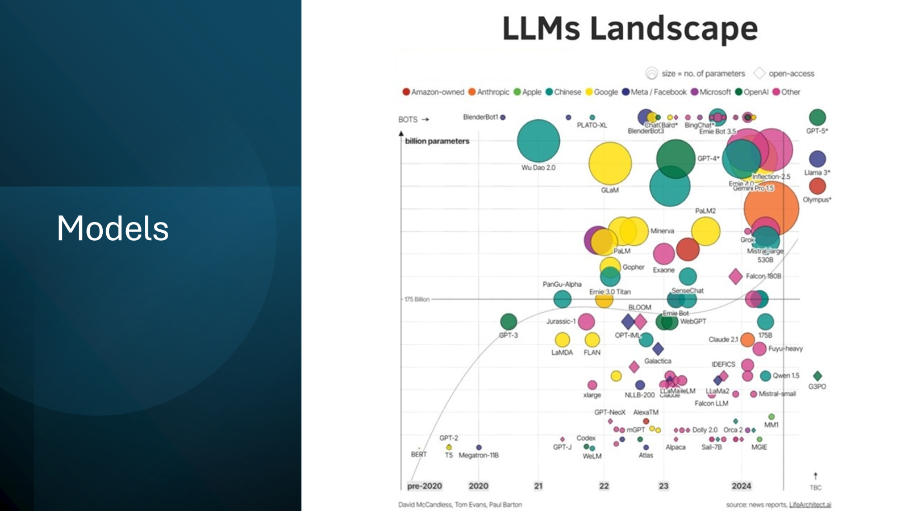

## State of AI Models (evolving at a very fast pace)

## Azure Open AI Services: https://learn.microsoft.com/en-us/azure/ai-services/openai/ 

## Prompting

## 𝗭𝗲𝗿𝗼-𝗦𝗵𝗼𝘁 𝗣𝗿𝗼𝗺𝗽𝘁𝘀
A zero-shot prompt tells the model: 
“Do the thing I want” 
Example of a Zero-Shot Prompt: 
Create a recipe for chocolate chip cookies. List all ingredients and steps.

## 𝗙𝗲𝘄-𝗦𝗵𝗼𝘁 𝗣𝗿𝗼𝗺𝗽𝘁𝘀
A few-shot prompt tells the model: 
“Do the thing I want, here are some examples, now do it”
Example of a Few-Shot Prompt: 
Create a recipe for chocolate chip cookies. Here’s an example recipe for oatmeal raisin cookies .... Create the chocolate chip cookie recipe now, referencing the example for help, and list all ingredients and steps.

## 𝗖𝗵𝗮𝗶𝗻-𝗼𝗳-𝗧𝗵𝗼𝘂𝗴𝗵𝘁 (𝗖𝗼𝗧) 𝗣𝗿𝗼𝗺𝗽𝘁𝘀
In Chain-of-Thought (CoT) Prompts, you explicitly direct the model to reason before answering (and, if you are providing few-shot examples, you provide those with reasoning as well).
Example of a CoT Prompt: 
Imagine you are creating a recipe for a dessert without any external resources. Think through the ingredients and steps before finalizing the recipe. 
Steps to create a recipe for chocolate chip cookies: 
- Think about common ingredients for cookies (flour, sugar, butter, etc.). 
- Consider the proportions needed for balance. 
- Plan the steps: mixing dry ingredients, creaming butter and sugar, adding eggs, combining all, and baking. 
Now, write the complete recipe for chocolate chip cookies with all ingredients and steps.

## 𝗠𝘂𝗹𝘁𝗶-𝘁𝘂𝗿𝗻 𝗣𝗿𝗼𝗺𝗽𝘁𝘀
A multi-turn prompt involves a back-and-forth interaction where the model builds on previous responses.
Example of a Multi-turn Prompt: 
User: How do I make chocolate chip cookies? 
AI: First, gather your ingredients: flour, sugar, butter, eggs, baking powder, salt, vanilla extract, and chocolate chips. 
User: Great, what’s the first step? 
AI: Preheat your oven to 350°F (175°C). In a bowl, mix flour, baking powder, and salt.

## 𝗥𝗲𝘁𝗿𝗶𝗲𝘃𝗮𝗹-𝗔𝘂𝗴𝗺𝗲𝗻𝘁𝗲𝗱 𝗚𝗲𝗻𝗲𝗿𝗮𝘁𝗶𝗼𝗻 (𝗥𝗔𝗚) 𝗣𝗿𝗼𝗺𝗽𝘁𝘀
RAG prompts involve retrieving information from a database or document to help generate a response.
Example of RAG Prompt: 
Using the provided document on baking techniques, answer the following question: What are the best practices for making chewy chocolate chip cookies?
