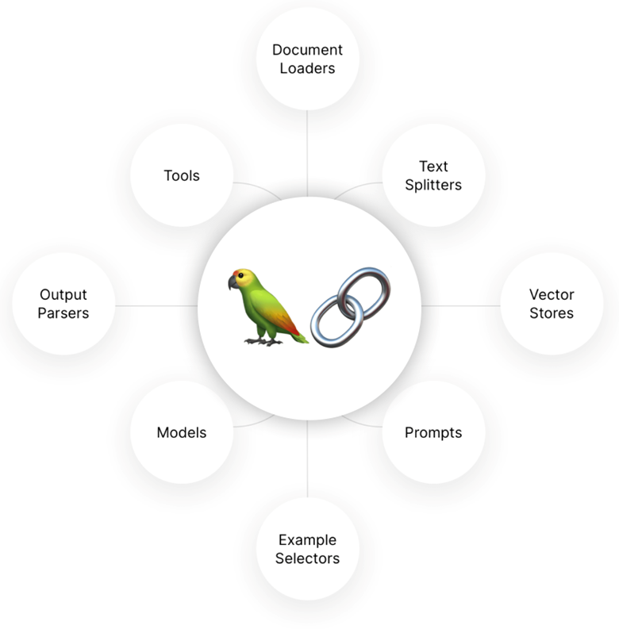
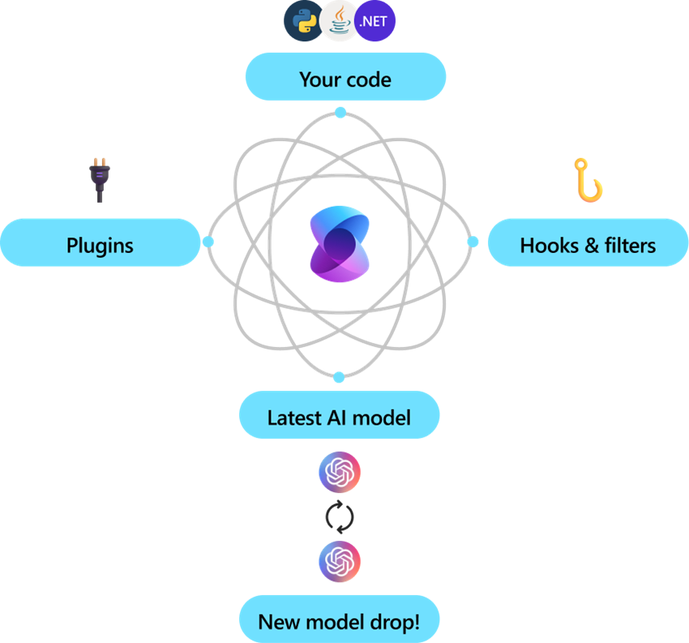

## AI Frameworks
Several Open-source platforms provide a cost-effective and flexible way to develop AI applications. They offer a wide range of tools and frameworks that can be customized and integrated into your application workflow.

## LangChain
https://www.langchain.com/

LangChain is an open-source framework designed to simplify the development of applications that integrate with large language models (LLMs). It provides tools and abstractions to manage the complexities of working with LLMs, such as prompt engineering, chaining multiple LLM calls, and integrating with external data sources. LangChain aims to make it easier for developers to build powerful, language-driven applications with minimal effort.

 

 ## Semantic Kernel
 https://github.com/microsoft/semantic-kernel 

 Semantic Kernel is an open-source project by Microsoft that focuses on enabling developers to build AI applications using semantic search and natural language understanding. It provides a set of tools and libraries to create, train, and deploy AI models that can understand and generate human language. Semantic Kernel is designed to be highly extensible and integrates seamlessly with other Microsoft AI services, making it a versatile choice for building intelligent applications.

 